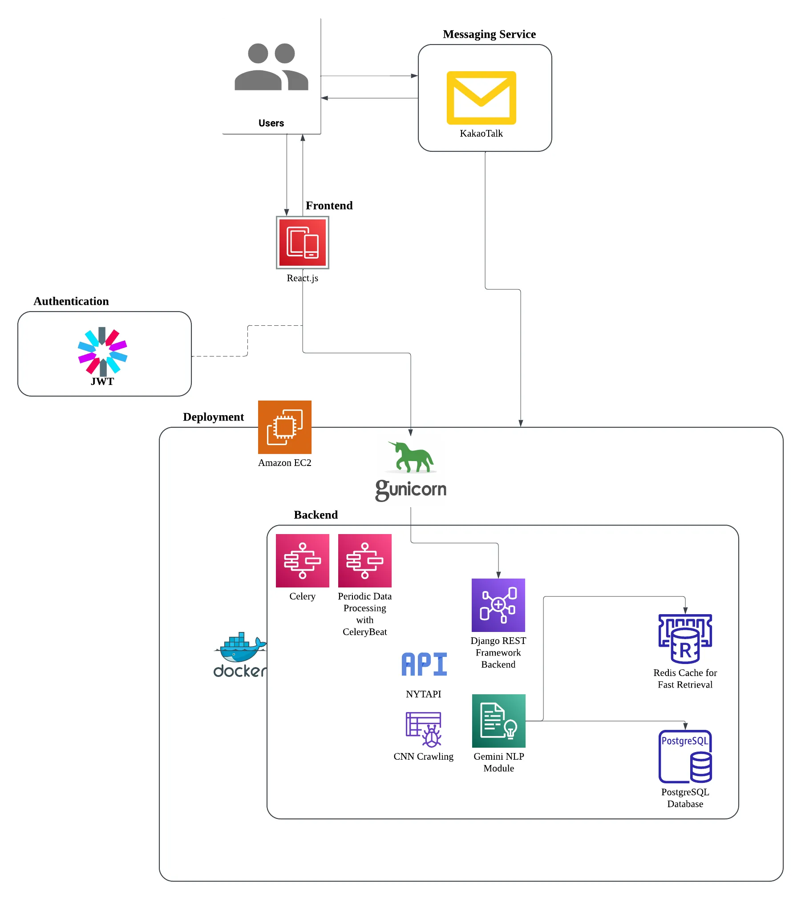
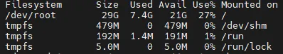
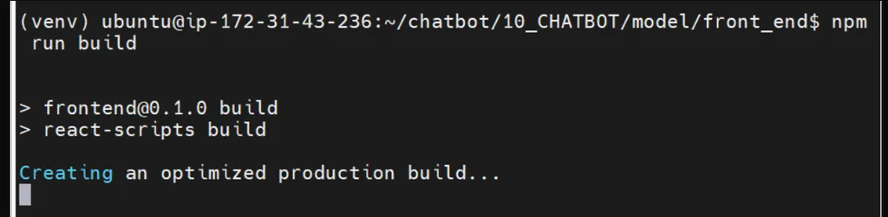
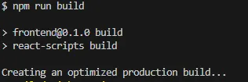
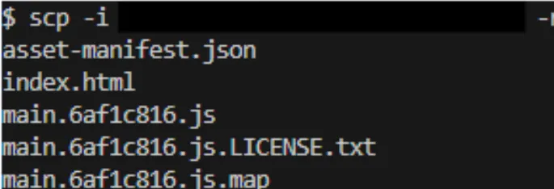

## "뉴스 한 스푼으로 채우는 영어실력" - SmartScoop-

## 📖 목차 
1. [팀 소개](#팀소개)
2. [프로젝트 소개](#프로젝트-소개) 
3. [기획의도](#기획의도)
4. [개발기간](#개발기간)
5. [주 사용 기술](#주-사용-기술) 
6. [서비스 아키텍처](#서비스-아키텍처)
7. [주요기능](#주요기능)
8. [기술적 의사결정](#기술적-의사결정)
9. [Trouble Shooting](#trouble-shooting)
10. [향후 개선 계획](#향후-개선-계획)
11. [유저 피드백 사항](#유저-피드백-사항)


### 팀소개
#### 10조 런봇(LearnBot)

|강의찬|정윤우|조현민|박수호A|
|:---:|:---:|:---:|:---:|
|팀장|팀원|팀원|서기|
|프론트엔드|챗봇 개발|데이터 크롤링 및 전처리|백엔드|

<br>

### 💡프로젝트 소개
- **사용자가 관심있는 외국 뉴스를 기반으로 학습할 수 있도록 도와주는 챗봇 서비스**입니다.
- 사용자는 **메신저 플랫폼을 통해 요약된 뉴스**와 **해당 기사에서 제공된 단어를 학습자료**로 받아볼 수 있습니다.
- 즉, **외국 뉴스를 기반으로 한 정보습득과 언어의 학습을 목적으로 한 학습용 챗봇**입니다.

<br>

### 💡기획의도
- 많은 사람들이 영어를 배우고자 하는 의지가 있지만, 여러가지 이유로 인해 결과적으로 만족스러운 공부를 하지 못하는 경우가 많습니다.
- 이를 보완하기 위해, 메신저 플랫폼을 이용해 사용자가 따로 신경쓰지 않아도 **그날의 작은 공부거리를 제공하는 것이 ‘SmartScoop’의 기획의도**입니다.
- 더 나아가 의미없는 단어의 나열이 아닌, **외국의 기사를 통한 의미있는 정보습득**이 더 의미가 있다고 생각해 단순한 단어제공이 아닌 외국의 기사를 선택하게 되었습니다.

### 개발기간
- 2024/12/31 ~ 2024/01/31

<br>


### 서비스 아키텍처




<br>
<br>

### ⚙️주 사용 기술

<details>
<summary> Frontend / UI </summary>
<div markdown="1">

- **React.js** : 사용자 인터페이스를 구축하기 위한 컴포넌트 기반의 JavaScript 라이브러리

</div>
</details>

<details>
<summary> Backend  </summary>
<div markdown="1">

- **Python** (3.10) : 다양한 라이브러리와 높은 확장성을 제공하는 백엔드 개발 언어

- **Django REST framework** (3.15.2) : API 개발을 위한 Django 기반 프레임워크로, 직관적인 설계와 강력한 기능 지원

</div>
</details>

<details>
<summary> LLM  </summary>
<div markdown="1">

- **Gemini 1.5 flash** : 기사의 요약본 생성, 기사에서 단어 추출해 단어장에 저장
</div>
</details>

<details>
<summary> DataBase  </summary>
<div markdown="1">

- **PostgreSQL** (16.6) : 사용자 데이터 및 설정 저장, 뉴스 데이터 영구 저장

- **Redis** (6.2) : 캐싱 및 뉴스 데이터 관리

</div>
</details>

<details>
<summary> Crawling  </summary>
<div markdown="1">

- **Celery** (5.4.0) :  주기적인 작업 및 대규모 작업 처리에 유용한 비동기 작업 큐

- **BeautifulSoup** (4.12.3) : HTML과 XML 데이터를 쉽게 파싱하고 원하는 정보를 추출할 수 있도록 돕는 Python 라이브러리

- **Selenium** (4.27.1) : 웹 브라우저를 자동화하여 동적 웹페이지의 데이터를 크롤링하거나 테스트할 수 있는 도구
</div>
</details>


<details>
<summary> Deploy  </summary>
<div markdown="1">

- **Docker** : 컨테이너 기반 가상화 플랫폼으로, 애플리케이션을 독립된 환경에서 효율적으로 빌드, 배포 및 실행
- **AWS EC2** : 클라우드에서 가상 서버를 제공하여 애플리케이션 실행, 테스트, 배포를 지원하는 확장 가능한 컴퓨팅 서비스

</div>
</details>

<br>


### 주요기능

#### LLM을 이용한 외국 기사의 요약 및 번역

- **Gemini 1.5 flash**를 이용하여 가볍게 읽기에 너무나 긴 기사들을 **요약 기능**을 통해, 사용자에게 제공
- **동시에 번역을 제공**하여 **사용자가 정보에 대한 흥미를 갖게 하기 위한 장치**로서 **활용**했으며, **적당한 난이도의 단어제공을 통한 학습효과 유도**

### 메신저 플랫폼을 이용한 접근성

- 현대인이라면 거의 반드시 가지고 있는 스마트폰이라는 매체의 활용을 시도
- 한국에서 가장 사용률이 높은 메신저 플랫폼인 카카오톡을 이용하여 상대적으로 챗봇에 대한 접근성을 높임.

### 외국의 기사의 데이터 크롤링

- 단순한 영어 문장의 전달이 아닌 정보제공으로서의 기능 또한 충족시키기위해 외국의 기사를 크롤링하여 사용자에게 제공할 소스로써 활용

<br>

### 💭기술적 의사결정


#### Gemini 1.5 flash와 다른 모델의 성능 비교
<details>
<summary><strong> 더보기 </strong></summary>
<div markdown="1">
- 
    
| **모델** | **기사 요약 소요시간(초)** | **기사 요약 + 추가질의 평균소요시간** |
| --- | --- | --- |
| Gemini pro | 1.97544 | 4.86609 |
| Gemini 1.5 flash | 1.53829 | 3.09793 |
| GPT4o-mini | 3.17234 | 2.92294 |
- **평균소요시간**이란 기사 요약에 걸린 시간과 몇 가지의 추가 질의에 답변하는데 걸린 시간의 총합의 평균시간을 의미
- **Gemini pro**의 경우 추가질의에 대답하는 시간이 다른 모델보다 길었으나 그만큼 답변 내용이 다른 모델보다 상세했음을 확인함.
- 추가 질의에 대한 답변 내용의 정확성 및 기사와의 연관성은 **Gemini Pro > Gemini 1.5 flash > GPT4o-mini** 순으로 더 뛰어남을 확인함.
- 추가 질의에 대한 답변 내용의 정확성 및 기사와의 연관성은 **Gemini Pro > Gemini 1.5 flash > GPT4o-mini** 순으로 더 뛰어남을 확인함.

👉 총합 시간은 근소하게 **GPT4o-mini가 더 빠르나**, **주요기능은 기사를 요약하는데 있기 때문에 Gemini 1.5 flash를 선택**


</div>
</details>

#### RAG를 구성을 하지 않은 이유

<details>
<summary><strong> 더보기 </strong></summary>
<div markdown="1">
    
    
- 프로젝트의 기획의도는 ‘외국의 기사의 요약본을 제공해주는 학습용 챗봇’이며, 또한 프로젝트에서의 ‘Gemini 1.5 flash’의 주 역할은 ‘외국 기사의 요약 및 번역’임.
- 기사의 요약 및 번역과 같은 기능은 테스트를 진행해본 결과, 특별한 학습을 진행하지 않더라도, 충분히 만족스러운 결과물을 뽑아낼 수 있는 것을 알아냄.

👉 위와  같은 이유로 본 프로젝트에서 별도의 RAG를 구성하지 않음.

</div>
</details>


#### 캐싱 전략

<details>
<summary><strong> 더보기  </strong></summary>
<div markdown="1">
    
    
**✅ 캐시 읽기 전략:  Look aside vs Read Through**

- Look aside 전략은 가장 기본이 되는 캐시 전략이면서 Redis가 다운되어도 서비스 제공 가능
- Read Throguh는 캐싱을 적극적으로 이용할 수 있으나 Redis 다운 시 서비스가 중지됨.

👉 위와 같은 이유로 안정성을 위해 **Look aside 전략 선택**

**✅ 캐시 쓰기 전략: Write Through vs Write Around vs Write Back**

- Write Through 전략은 항상 캐시와 DB의 데이터가 동기화된 상태로 추가적인 동기화 로직을 구현하지 않아도 되며 실시간 요청 처리 속도가 빠름
- Write Around 전략은 사용자의 데이터 요청이 많으면 DB에 부하를 주게 되며 실시간 요청 처리 시 시간이 많이 걸림
- Write Back 전략은 캐시와 DB간 동기화 로직이 필요하며 Redis 장애 시 데이터 손실 가능성이 있음

👉 로직이 비교적 간단하고 빠른 데이터 제공에 유리한 **Write Through 전략 선택**

</div>
</details>


#### 크롤링 및 데이터 전달 시 비동기 작업 도구 선택

<details>
<summary><strong> 더보기 </strong></summary>
<div markdown="1">
    
| **특징** | **Celery** | **Scarpy** | **BeautifulSoup+ Requests** | **AWS Lambda** |
| --- | --- | --- | --- | --- |
| 설치/설정 복잡성 | 브로커 설정 필요 | 파이썬 패키지로 간단하게 설치 가능 | 파이썬 내장 라이브러리로 간단하게 사용 가능 | AWS 계정 및 Lambda 함수 설정 필요 |
| 비동기 처리 | **지원** | 제한적 (scarpy-redis 사용) | 직접 구현 필요 | 자동 확장 |
| 주기 작업 관리 | **지원(django-celery-beat)** | 지원하지 않음 (스케줄러 별도로 필요) | cron 작업이나 celery 연동 필요 | 지원(EventBridge) |
| 확장성 | 워커 수를 조절하여 확장 가능 | Redis 기반으로 확장 가능 | 확장성 낮음 | 작업량에 따라 자동 확장 |
| 유지 보수 | 브로커와 워커 관리 필요 | Scrapy 프로젝트 구조로 통합 관리 용이 | 관리가 간단함 | 함수 단위로 유지보수 필요 |
| 웹사이트 유형 | 모든 유형 | 정적 및 일부 동적 웹사이트 | 정적 웹사이트에 더 적합 | 모든 유형 |
| 단점 | 설정이 복잡할 수 있음 | 비동기 처리와 확장성이 제한적임 | 동적 크롤링과 그이후의 과정까지 한번에 처리하기 어려움 | **실행 시간 제한(15분)→작업 병렬처리 필요** |
- 본 프로젝트는 데이터셋 크롤링/api로 받아온 후 챗봇에 데이터를 전달, 챗봇 작업물의 DB저장까지를 비동기로 처리하고 주기적(1일 1회)으로 작업을 하도록 설정하는 것이 중요함.
- 따라서 비동기 처리와 주기 작업 관리에 유리한 도구를 우선으로 생각함.
- Celery와 AWS Lambda가 다른 도구들에 비해 우수했는데, AWS Lambda는 15분까지만 실행되므로 작업을 작은 단위로 나눠서 병렬로 처리해줘야 하는 어려움과 도구를 별도로 학습을 한 후 적용해야 함.

👉  위와 같은 이유로 프로젝트에 더 적합한 **Celery를 선택**함.

</div>
</details>

#### html → React 프론트엔드 교체

<details>
<summary><strong> 더보기 </strong></summary>
<div markdown="1">
    
**✅ 연동성 문제로 인한 기술 스택 변경 결정**

- 초기 프론트엔드는 HTML 기반으로 제작을 시도
- 그러나 결과물 구현 과정에서 Django REST Framework(DRF)와의 연동성 부족으로 인해 빈번한 충돌이 발생하는 문제점이 발견됨.
- 이러한 한계점으로 HTML이 프로젝트의 원활한 진행에 적합하지 않다고 판단함.
- React는 컴포넌트 단위로 UI를 설계하여 코드의 재사용성을 극대화할 수 있고, 동일한 기능이나 UI 요소를 프로젝트 전반에서 반복적으로 사용할 수 있어 유지보수가 용이하고, 개발 속도가 비약적으로 향상된다는 장점이 있음.

    👉 위와 같은 이유로 React 기반 프론트엔드 개발을 진행하기로 결정함.

</div>
</details>


#### API 초당 요청 한도 초과

<details>
<summary><strong> 더보기 </strong></summary>
<div markdown="1">
    
기사의 요약과 단어 추출 과정에서 사용되는 언어 모델 API의 초당 요청 한도 초과를 피하기 위해 코드 내에 대기시간을 설정함.

| **시간(초)** | **`fetch_and_store_cnn_news.delay()`** | **`fetch_and_store_nyt_news.delay()`** |
| --- | --- | --- |
| 15 | O | O |
| 10 | O | O |
| 5 | O | O |
| 3 | O | O |
| 2 | O | X |
| 1 | O | X |

👉 테스트 결과 API 한도 초과를 피할 수 있는 최소 대기시간은 3초로 결정했고, 요약본과 단어추출을 하는데 3초의 대기시간을 추가함.

</div>
</details>


<br>
<br>

### ⚠️Trouble Shooting

#### EC2 서버 에러

<details>
<summary> 더보기 </summary>
<div markdown="1">

**✅ 문제 발생 상황** 

웹 페이지를 띄우지 못하고,

```python
docker-compose up --build
```

을 통한 빌드 작업 간에 SQL 체크포인트 생성이라는 오래 걸리지 않는 작업임에도 불구하고,  아래의 로그 상태처럼 진행이 되지 않는 문제가 발생함.

```python
postgres_db | 2025-01-23 14:56:46.905 UTC [25] LOG:  checkpoint starting: time
postgres_db | 2025-01-23 14:56:47.343 UTC [25] LOG:  checkpoint complete: wrote 8 
buffers (0.0%); 0 WAL file(s) added, 0 removed, 0 recycled; write=0.410 s, sync=0.008 s, 
total=0.438 s; sync files=7, longest=0.004 s, average=0.002 s; distance=9 kB, 
estimate=9 kB; lsn=0/1A7E7A0, redo lsn=0/1A7E768
```

문제 해결을 위해 어떻게든 빌드 작업을 진행했지만 크롤링이 제대로 진행이 되지 않는 등,  EC2 서버가 제대로 움직이지 않는 문제가 발생함.

**✅ 추정되는 원인**

 `/dev/root` 파일시스템 용량이 80% 이상 차지하고 있었고 이로 인해 서버가 제대로 움직이지 않는다고 판단함.

**✅ 문제 해결 방법**

 AWS EC2 의 콘솔에서 볼륨(스토리지 용량)을 늘려주는 `스케일업` 작업을 실시함.

- AWS EC2 콘솔에서 인스턴스 볼륨을 `8GB → 30GB`로 늘림.
- 적용 방법

```python
# 1.디스크 용량 확인
$ sudo df -h

# 2. 인스턴스에 연결된 볼륨의 디바이스 이름 확인
$ lsblk

# 3. 파티션 확장
$ sudo growpart /dev/xvda 1

# 4. 파티션 확장 확인
$ lsblk # xvda1 파티션을 보면 7.9GB에서 29GB 변경됨을 확인할 수 있음.
```

**✅ 문제 해결**



빌드 과정에서 멈추거나 하는 등의 문제 현상을 부분적으로 해결함.


</div>
</details>


#### npm build 진행 불가

<details>
<summary> 더보기 </summary>
<div markdown="1">

**✅ 문제 발생 상황** 

프론트 엔드를 수정한 후에 `npm build` 를 통해 최적화 작업을 실행하였으나, 아래 이미지처럼 진행이 되지 않는 현상이 발생함.



**✅ 문제 원인**

ec2 서버 자체의 성능적 문제 혹은 서버 자체 문제로 build가 정상적으로 진행되지 않는 버그가 있을 수 있다고 판단함.

**✅ 문제 해결 아이디어**

로컬에서 서버와 같은 프론트엔드 환경을 만들어 로컬내에서 build를 실행하여 로컬에 build 파일을 작성함.



**✅ 문제 해결**

로컬 내에서 파일을 작성한 후에,  scp 명령어와  .pem 키를 이용하여, 직접적으로 로컬에서 서버로 이동하는 방법을 선택한 후 빌드에 성공함.



</div>
</details>


#### 소셜 계정 동일 아이디 사용 불가

<details>
<summary> 더보기 </summary>
<div markdown="1">

- **소셜 계정 동일 아이디 사용 불가**
    
    
    **✅ 문제 발생 상황** 
    
    가입한 회원은 카카오 계정으로 가입했고 아이디는 “my_id” {”provider”:”kakao”, “social_id”:”my_id”} 일 때,  
    
    아래와 같은 discord 계정으로 같은 아이디로 가입하려고 하면 `integrityerror` 발생
    
    {”provider”:”discord”, “social_id”:”my_id”} 
    
    **✅ 오류 메시지**
    
    ```java
    IntegrityError at /api/v1/socials/link-social-account/
    UNIQUE constraint failed: socials_customsocialaccount.uid
    ```
    
    **✅ 문제 해결 아이디어**
    
    대부분 같은 사람이면 여러 social에 같은 아이디로 가입하는 경향이 많고, 만약
    
    {”provider”:”kakao”, “social_id”:”my_id”}이 사람과 {”provider”:”discord”, “social_id”:”my_id”} 이 사람이 다른 사람이라면 더욱 에러가 발생해서는 안됨.
    
    **✅ 기존코드**
    
    ```python
    class CustomSocialAccount(models.Model):  
        user = models.ForeignKey(
            User,
            on_delete=models.CASCADE,
            related_name="custom_social_accounts"
        )
        provider = models.CharField(max_length=50)
        uid = models.CharField(max_length=255, unique=True)
        created_at = models.DateTimeField(auto_now_add=True)
        updated_at = models.DateTimeField(auto_now=True)
    
        def __str__(self):
            return f"{self.provider} - {self.user.username}"
    ```
    
    ```python
    class LinkSocialAccountView(APIView):
        """
        로그인한 사용자가 소셜계정을 연동할 때
        """
        permission_classes = [IsAuthenticated]
    
        def post(self, request):
            provider = request.data.get('provider')
            social_id = request.data.get('social_id')
            user = request.user
    
            if CustomSocialAccount.objects.filter(user=user, provider=provider).exists():
                return Response({"message": "이미 연결된 소셜 계정입니다."}, status=400)
    
            CustomSocialAccount.objects.create(user=user, provider=provider, uid=social_id)
            if provider not in user.connected_social_providers:
                user.connected_social_providers.append(provider)
            user.is_social_connected = True
            user.save()
    
            return Response({"message": f"{provider} 계정이 성공적으로 연결되었습니다."})
    ```
    
    → models의 uid 설정이 `unique=True` 로 되어있는데 이 부분을 수정해야 함.
    
    → 그리고 중복검사를 할 때 user와 provider가 아닌 provider와 social_id를 받도록 해야함.
    
    **✅ 수정한 코드**
    
```python
class CustomSocialAccount(models.Model):  
    user = models.ForeignKey(
        User,
        on_delete=models.CASCADE,
        related_name="custom_social_accounts"
    )
    provider = models.CharField(max_length=50)
    uid = models.CharField(max_length=255, unique=False)
    created_at = models.DateTimeField(auto_now_add=True)
    updated_at = models.DateTimeField(auto_now=True)

    class Meta:
        unique_together = ('provider', 'uid')
        
    def __str__(self):
        return f"{self.provider} - {self.user.username}"
```
    
    → provider+uid 조합을 고유값으로 처리
    
    ```python
    class LinkSocialAccountView(APIView):
        """
        로그인한 사용자가 소셜계정을 연동할 때
        """
        permission_classes = [IsAuthenticated]
    
        def post(self, request):
            provider = request.data.get('provider')
            social_id = request.data.get('social_id')
            user = request.user
    
            if CustomSocialAccount.objects.filter(provider=provider, uid=social_id).exists():
                return Response({
                    "status": "error",
                    "message": "이미 연결된 소셜 계정입니다."
                    }, status=400)
    
            CustomSocialAccount.objects.create(user=user, provider=provider, uid=social_id)
            if provider not in user.connected_social_providers:
                user.connected_social_providers.append(provider)
            user.is_social_connected = True
            user.save()
    
            return Response({"message": f"{provider} 계정이 성공적으로 연결되었습니다."})
    ```
    
    → 중복검사는 provider와 uid만 하도록 수정
    
    **✅ 문제 해결**
    
    - migration 후 실행했더니 동일한 아이디도 provider가 다르면 가입이 가능할 수 있게 됨.


</div>
</details>


#### API 초당 요청 한도 초과

<details>
<summary> 더보기 </summary>
<div markdown="1">

# API 초당 요청 한도 초과

## 문제 발생 상황
기사를 요약하고 단어를 추출하는 과정에서 API 한도 초과 오류가 발생하는 것을 확인

## 문제 해결 아이디어
챗봇코드와 CNN 크롤링 코드를 통합하여 크롤링 후 챗봇에 바로 기사를 넘기도록 함

## 오류 메시지
```
google.api_core.exceptions.ResourceExhausted: 429 Resource has been exhausted (e.g. check quota)
```

## 기존 코드
```python
class learnChat:
    model = genai.GenerativeModel("gemini-1.5-flash")
    chat = model.start_chat(history=[{'role':'user', 'parts':article.content}])
    # fetch Gemini API Key
    os.environ["GOOGLE_API_KEY"] = getpass("Gemini API Key:")

    # create summary
    def Summary():
        summary = []
        summary[0] = chat.send_message("입력된 내용을 영어로 요약해서 출력해줘. 요약문은 100자 이내여야 해.").text
        while len(summary) > 400:
            summary[0] = chat.send_message("너무 길어, 더 줄여줘.").text
        summary[1] = chat.send_message("요약본을 한국어로 번역해줘").text
        return summary

    # create vocab
    def vocab():
        prompt = """
        영문 요약본에서 적당한 난이도의 단어 3개만 찾아줘, 단어 옆에  한국어 뜻을 붙여줘. 단어와 뜻만 출력해. 
        예시: 
        collates 모으다
        Crucial 중요한
        Attributed 귀속된
        """
        response = chat.send_message(prompt)
        response = response.text.split('\n')
        response.pop()
        vocab = {}
        for i in range(len(response)):
            v, m = response[i].split(maxsplit=1)
            vocab[v] = m
        return vocab
```

## 추정되는 원인
1. CNN과 NYT 데이터를 처리하는 Celery 작업에서 챗봇 API를 호출할 때, 요청이 잦아 `ResourceExhausted` 오류발생
2. 특히 요약과 번역 작업을 합쳐 실행하는 경우, 반복적인 요청으로 인해 Google Generative AI의 쿼터가 소진되는 것으로 추정

## 구체적인 해결방법
1. 요약과 번역을 별도의 함수로 분리
2. 기존의 `while len(summary[0]) > 400` 루프를 제거하여 반복요청을 줄임
3. `time.sleep(sleep)` 추가하여 요청간 대기시간 조정

## 수정 코드
```python
import google.generativeai as genai
from django.conf import settings
import time

genai.configure(api_key=settings.GEMINI_API_KEY)

class learnChat:
    def __init__(self, article_content):
        self.model = genai.GenerativeModel("gemini-1.5-flash")
        self.chat = self.model.start_chat(history=[{'role': 'user', 'parts': article_content}])
        self.sleep = 3

    def summarize(self):
        summary_english = self.chat.send_message("입력된 내용을 핵심만 80자 이내로 영어로 요약해줘.").text
        return summary_english

    def translate(self, text):
        time.sleep(self.sleep)
        translated_text = self.chat.send_message(f"다음 영어 텍스트를 한국어로 번역해줘: {text}").text
        print(self.sleep)
        return translated_text

    def vocab(self):
        time.sleep(self.sleep)
        prompt = """
        핵심 내용에서 적당한 난이도의 단어 3개만 찾아줘, 단어 옆에 한국어 뜻을 붙여줘.
        단어와 뜻만 출력해.
        """
        response = self.chat.send_message(prompt)
        vocab = {}
        for line in response.text.split('\n'):
            if line.strip():
                word, meaning = line.split(maxsplit=1)
                vocab[word] = meaning
        print(self.sleep)
        return vocab
```

## 문제 해결
- `sleep`이 에러를 발생시키지 않는 최소 대기시간이 되게 테스트 진행
- 최종적으로 `sleep=3`으로 결정하여 문제 해결

|sleep (초)|fetch_and_store_cnn_news.delay()|fetch_and_store_nyt_news.delay()|
|-|-|-|
|15|O|O|
|10|O|O|
|5|O|O|
|3|O|O|
|2|O|X|
|1|O|X|


</div>
</details>


 

 ### 향후 개선 계획

#### 카카오톡 봇에서 제공할 수 있는 기능 추가

<details>
<summary> 더보기 </summary>
<div markdown="1">

헤드라인 뉴스 제공 추가
타이틀에 번역 제목 추가 - 흥미도를 높이기 위해
단어장기능, 퀴즈기능 추가 등등
카카오톡 봇을 통해 보여드리거나 개선할 기능이 있다고 생각합니다.

</div>
</details>

#### 메신저플랫폼 추가


<details>
<summary> 더보기 </summary>
<div markdown="1">

현재 카카오톡으로 서비스를 진행하고 있지만, 
추후에 메신저 플랫폼의 추가하여, 
서비스의 접근성을 높일 수 있게 하고 싶습니다.

</div>
</details>

 <br>
 <br>

### ✔️유저 피드백 사항

#### 카테고리 버튼, 키워드 버튼 추가

<details>
<summary> 더보기 </summary>
<div markdown="1">

#### 문제


| '기사를 조회하고 싶을 때, 타자를 일일히 입력하는 것은 부담스럽다. ' |
|--------------------------------|

라는 피드백을 받았다.

실제 테스트 결과,
익숙해진 사용자는 바로 카테고리 키워드 입력을 통해 기사를 접할 수 있었다.

>하지만 첫 사용자 혹은,키워드를 외우지 못한 사용자가 카테고리 키워드에 닿기 위해서는
>안내의 문구를 이용해서 카테고리 안내를 받거나,
'카테고리'문구를 이용해서 문구를 안내받은 후,
>'카테고리 키워드'를 입력하여 조회해야 기사에 접할 수 있었다.

- 즉, 첫 사용자나, 익숙해지지 못한 사용자는 2번에서 3번을 직접 입력을 해야 기사에 접할 수있었다. 


사용자의 편의성의 문제가 있는 것을 발견했다.

이를 개선하여 챗봇의 편의성 증가시키기 위해,
채팅창 하단에 **카테고리 키워드의 리스트 버튼**을 추가했다.

리스트나 카드형태도 가능하지만, 
시인성이나, 편의성 면에서 '바로연결'버튼이 챗봇의 움직임에 적당하고 판단하여 추가하였다.


<br>
<br>
<br>
<br>


### 추가 개선 사항

테스트 결과,
버튼 추가로 인하여, 
안내를 받지 않아도 되는 점 등을 감안해 
키워드로의 접근성이 상당히 높아졌다고 판단된다.

>하지만 카테고리 리스트 버튼을 이용하기 위해서는
>사용자가 '카테고리' 라는 키워드를 직접 입력해야한다.

>이는 위에서 받은 피드백 사항과 중복될 수 있는 문제이기 때문에,
>개선 결정했다.

#### 문제점

위의 '카테고리 키워드' 버튼은 
'카테고리' 라는 키워드를 입력함으로써 
나오는 '바로연결'버튼이라는 기능을 사용했다.

하지만 '바로연결' 버튼은 특정 키워드를 입력해야지만 
채팅창의 하단에 띄울 수 있는 문제점이 있다.

>즉 '바로연결' 버튼으로 카테고리 버튼을 구현하기위해서는 
>사용자가 다른 키워드를 입력해서 '카테고리'라는 버튼을 띄워야한다는 문제점을 가짐

 - '바로연결'버튼은 사용하지 못하는 것으로 판단.

#### 다른 해결책 모색

여러 해결책을 생각해본 결과,
다른 버튼, 리스트, 카드 등을 띄우는 방식은 
'바로연결' 버튼과 마찬가지의 문제점을 가지고 있는 것을 확인했다.

대체방법을 찾는 중 '봇 리스트'라는 기능을 발견했고, 
이 기능은 항시 채팅창의 하단에 원하는 버튼을 추가할 수 있는 기능이었다.

현재 원하는 기능이라고 판단하였고, 챗봇에 기능을 추가하였다.

#### 결과

테스트 결과,
항시 띄워져있는 '카테고리' 버튼은 높은 편의성을 가지고 있는 것으로 판단했다.

- 개선 완료


</div>
</details>


